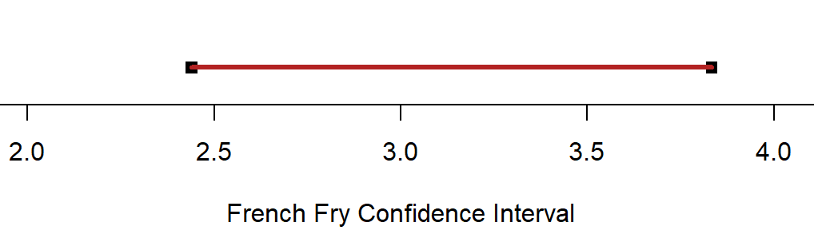
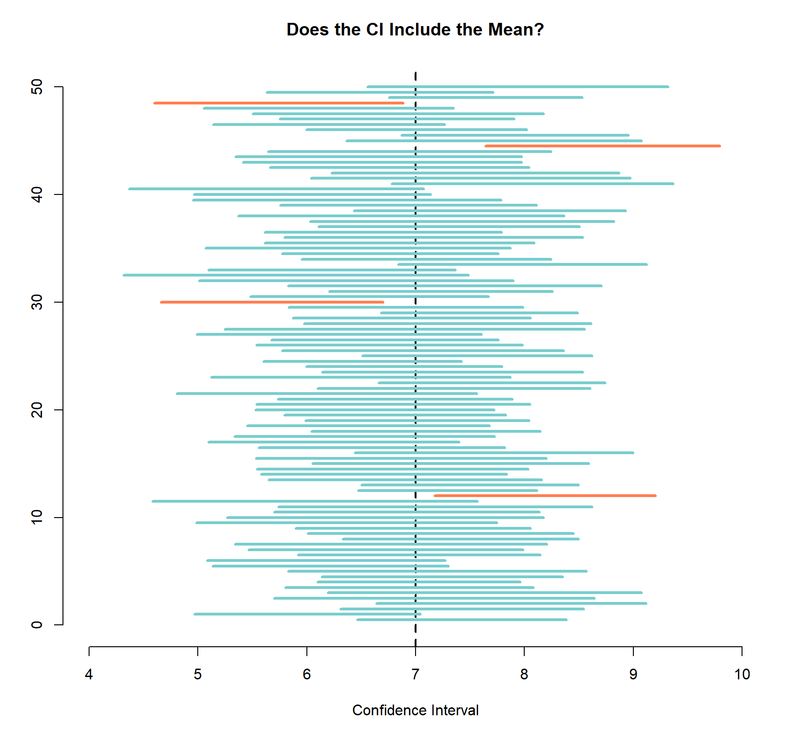

# Confidence Intervals
Long story short, a conficence interval is our best guess for a parameter using the data that we got from out sample. For example, imagine that we are trying to figure out the average length of a french fry out of a Rally's drive-in, and suppose that a partiular random sample from the nearest Rally's yield $\bar{x}=3.76$ inches. Due to sampling variability, it is _never_ the case that $\bar{x}=\mu$, and our point estimate alone $(\bar{x})$ says nothing about how close it might be to $\mu$. Thus, since $\bar{x}$ is generally such a poor estimator for $\mu$, statisticians don't use a single value to estimate $\mu$, but instead a range of plausible values--an _interval estimate_ or a _confidence interval_.

The first step to calculating a confidence interval is always to choose your level of confidence, which is a measure of the degree of reliability of your interval. Using the example above, lets say that the lower bound for our confidence interval is 2.44 inches and our upper bound is 3.83 inches (usually, this is written surrounded by parentheses such as '(2.44, 3.83)'). This would imply that, because of the measurements we got in the sample, guessing $\mu$ to be any value between 2.44 inches and 3.83 inches is plausible. The figure below draws this interval. A "95% confidence level" implies that, if we were to take many samples of french fries and compute a confidence interval for each of them, then 95% of those confidence intervals would contain the real average french fry length, $\mu$.

We can tell how precise an interval estimate is judging by the width of the interval. If our confidence level is high and the resulting confidence interval is narrow, then our knowledge of the value of $\mu$ is reasonably precise. On the other hand, a very wide confidence interval, shows that we are not very certain about what we are estimating.

There are many ways to calculate confidence intervals for population means, but the one used in most introductory statistics classes is as follows: $$\bar{x} \pm t^{*} \cdot \frac{s}{\sqrt{n}}$$

where $\bar{x}$ is the sample mean, $t^{*}$ is the $t$-critical value that corresponds to the desired confidence level, $s$ is the standard deviation of our sample, and $n$ is the sample size.

Finally, when it comes to interpreting a confidence interval, think of gathering sample after sample after sample of size 100 from a normal population and calculating a confidence interval for each sample. Both the center of the interval $(\bar{x})$ and its width (margin of error) will vary from sample to sample. However, in the long run, we will see that 95% of such confidence intervals will capture the real value of $\mu$ in between the lower limit and the upper limit.

In the image above, I generated 100 random samples from a normal population with $\mu=7$ and computed a 95% confidence interval for each of them. Then, I plotted the confidence intervals on top of each other to see which ones captured the true mean and which ones didn't. The blue intervals contain the true value of $\mu$ while the orange ones don't. As you can see, only 4 missed the mean, which is one fewer than we would expect!
